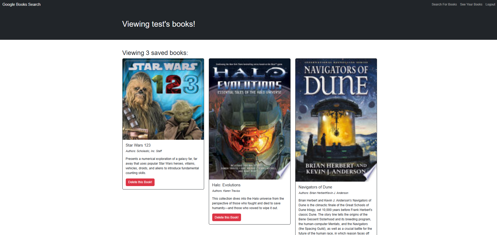

# Book Search Engine


## Table of Contents
- [Description](#description)
- [Installation](#installation)
- [Technologies](#technologies)
- [License](#license)
- [Links](#links)
- [Questions](#questions)

## Description
The purpose of this repo, and this project, is to convert a fully functional Google Books API based search engine that is built with RESTful API, with a GraphQL API based application built with Apollo Server.

## Installation
If you want to run locally, run these commands from the root:

```bash
mongodb
npm run build
npm run develop
```

NOTE: Be aware you will need MongoDB to run locally. Use .env.EXAMPLE at server root to configure for yourself. 

And finally, below is a screenshot from within the application after registering a user, and logging some books.



## Technologies
- JavaScript/TypeScript
- Google Books API
- MongoDB

## License
This project is licensed under the MIT license.

## Links
- [GitHub Repo](https://github.com/Bakenavva/Book-Search-Engine)
- [Deployed Application](https://book-search-engine-hv58.onrender.com)

## Questions
Further questions can reach me via:
- GitHub: [Bakenavva](https://github.com/Bakenavva)
- Email:  ernestoaleman00@gmail.com
